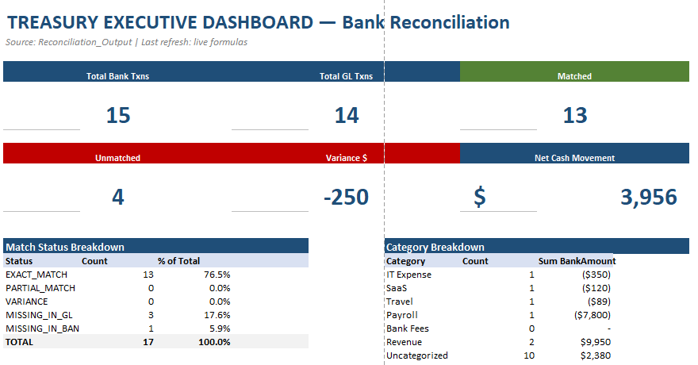

# Automated Bank Reconciliation Model

## Overview

Excel-based treasury solution designed to automate and improve the bank reconciliation process.

---

## Business Objectives

- Reconcile bank statements efficiently
- Identify unmatched transactions
- Improve treasury visibility
- Reduce manual reconciliation work
- Support financial controls

---

## Tools Used

- Excel
- Power Query
- Pivot Tables
- Financial Analysis

---

## Features

- Automated transaction matching
- Reconciliation tracking
- Treasury reporting
- Financial summaries
- KPI monitoring

---

## Screenshots

---

## Business Value

This solution improves reconciliation efficiency, reduces manual work, and enhances treasury controls.