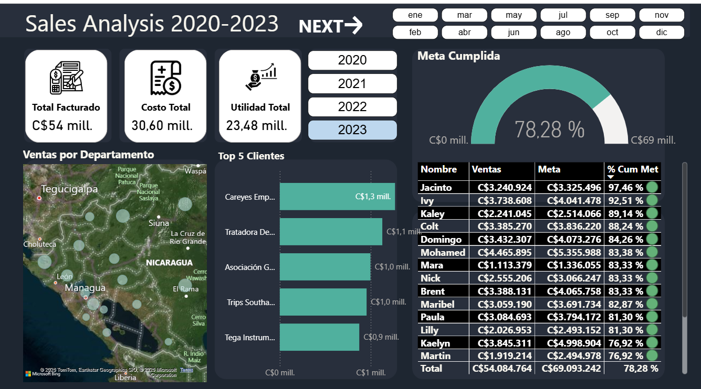
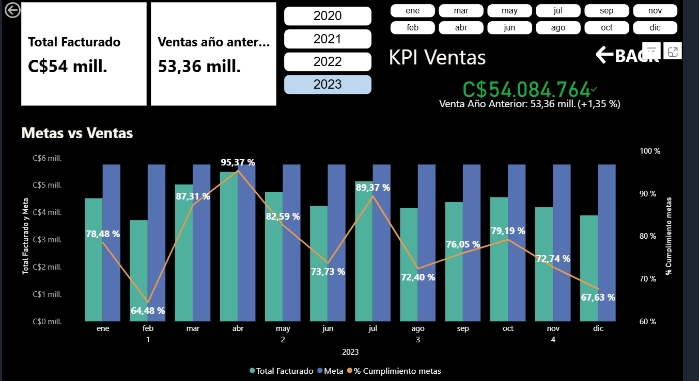

## Sales Analysis Dashboard (2020-2023)

## Overview

Interactive Power BI dashboard developed to analyze sales performance, profitability, KPIs, and target achievement across multiple years.

---

## Business Objectives

- Track revenue performance
- Monitor profitability
- Analyze sales by department
- Evaluate target achievement
- Identify top-performing clients

---

## Tools Used

- Power BI
- DAX
- Excel

---

## Features

- Interactive filters by year and month
- KPI performance tracking
- Sales target analysis
- Geographic sales visualization
- Top customer analysis
- Multi-page dashboard navigation

---

## Dashboard Preview

### Main Dashboard

---

### KPI Analysis

---

## Key Insights

- Total revenue exceeded C$54 million
- KPI tracking improved sales visibility
- Target achievement analysis identified high-performing periods

---

## Live Dashboard

([View Live Dashboard](https://app.powerbi.com/view?r=eyJrIjoiMmFhYTBlNzYtZTA4NC00ZWQ2LWFhMTAtNjJiOWE3NDJhYzc1IiwidCI6IjkwM2ExYmRlLWE4NzQtNGZlNC05MTU0LWZhNTMyMTNhMThkOSIsImMiOjR9))